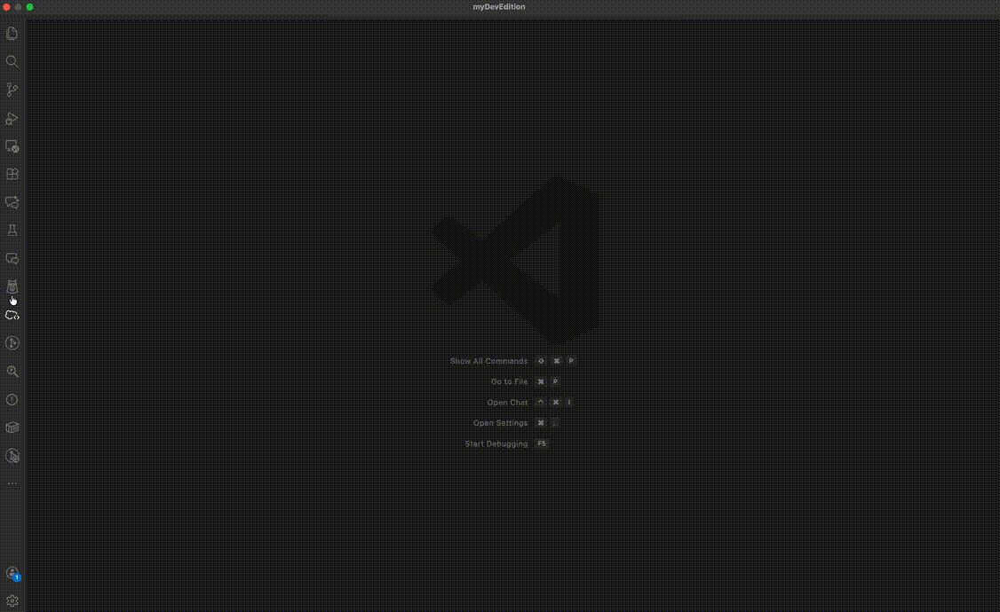

# ImpactLens — Salesforce Dependency Analyzer

> **Fast, intelligent search and impact analysis for Salesforce DX projects — right inside VS Code.**

[](CHANGELOG.md)
[](https://code.visualstudio.com/)
[](LICENSE)

---

## Demo

<!-- Replace with your actual recording. Recommended: 800px wide, 10-15fps, < 5 MB -->



> **Search → Results → Impact Analysis** — all in one click.

---

## Features

### 🔍 Advanced Search Panel

Search across your entire Salesforce project with a fast, full-featured webview panel.

- **30 metadata types** — Apex Classes, Triggers, LWC, Aura, Flows, Validation Rules, Workflow Rules, Custom Objects, Custom Fields, Custom Metadata, Permission Sets, Profiles, Layouts, Reports, Email Templates, Named Credentials, Platform Events, Visualforce Pages & Components, Custom Labels, Static Resources, FlexiPage, Approval Processes, Sharing Rules, Record Types, Quick Actions, Global Value Sets, Custom Settings
- **Filter presets** — one-click _All_, _Source_ (Apex + LWC + Aura + Flows), _Metadata_ (Objects + Permissions + Labels), or _Clear Filters_
- **Exact match toggle** — switch between fuzzy/smart and strict whole-word matching
- **Term highlighting** — matched words highlighted in file names and code previews
- **Live summary pills** — Total / Visible / Page range / Exact Mode indicator
- **Smart tokenization** — understands camelCase, PascalCase, `__c`, and dot-separated API names
- **Fuzzy + prefix matching** — finds results even with partial names or minor typos

### 📄 Results Table

| Column      | Details                                     |
| ----------- | ------------------------------------------- |
| **File**    | Clickable filename (hover for full path)    |
| **Type**    | Metadata type badge                         |
| **Object**  | SObject API name when applicable            |
| **Line**    | Line number (click filename to jump there)  |
| **Preview** | Code snippet with matched terms highlighted |

- **Column sorting** — click any header to sort asc/desc; indicator arrow shown
- **Table filter** — live narrow across all columns simultaneously
- **Click-to-open** — click any filename to jump directly to that line in the editor
- **Pagination** — numbered page buttons `‹ 1 … 4 5 6 … 20 ›` with First/Last and jump-to-page
- **Page size** — 10 / 50 / 100 results per page
- **State persistence** — sort, filter, page, and all toggle states survive panel hide/show cycles

### ⚡ Impact Analysis & Risk Scoring

Analyze the blast radius of changing a field, object, class, or any metadata element.

- **Multi-hop traversal** — follows transitive dependencies up to 5 hops deep (configurable via `sfSearch.impactDepth`)
- **Cycle detection** — automatically detects and reports circular dependencies
- **Risk scoring (0-100)** — composite score based on reference count, file spread, depth, and type-weighted severity; mapped to **Low / Medium / High / Critical** levels
- **Color-coded risk badge** in the sidebar summary (green → orange → red → error)
- **Export reports** — CSV, JSON, or Markdown via `ImpactLens: Export Impact Report` command
- Sidebar tree view with click-to-navigate, rich tooltips, and dependency depth tracking
- Test classes weighted at 0.3× to avoid inflating production risk scores

### 🔎 CodeLens & Hover

- **CodeLens** — reference counts shown above Apex class/trigger/interface declarations and LWC/Aura component files; click to run impact analysis. Controlled by `sfSearch.enableCodeLens`.
- **Hover** — hover over any Salesforce API name to see a mini impact summary (reference count, file count, metadata types) with clickable _Search_ and _Analyze Impact_ links.

### 🌲 Sidebar Tree Views

Two Activity Bar panels give you persistent visibility without opening the webview:

**Search Results tree**

- Groups results by metadata type, sorted by match count (largest group first)
- Color-coded icons per type (blue = Apex, green = LWC, orange = Triggers, purple = Flows, …)
- Rich Markdown tooltip: file, line, object, relevance score, relative path, snippet
- Friendly "Run a search to see results here" placeholder

**Impact Analysis tree**

- Root node → dependency chain expandable to any depth
- Type-aware icons resolved from the node's metadata type string
- Smart child sort: deeper dependency chains first, then by reference count
- Reference count + line number shown in VS Code's description field

### ⚡ Performance

- **Worker thread indexing** — file parsing runs on a background thread; UI stays responsive
- **MiniSearch full-text index** with custom camelCase/underscore tokenizer
- **Dual-strategy search** — precise reference-graph lookup merged with full-text recall, deduplicated by `filePath:line`
- **Persistent cache** — index saved to `context.globalStorageUri/search-index.json` and reloaded on restart (no re-parse on every open)
- **Incremental updates** — FileSystemWatcher triggers targeted re-index; mtime check prevents redundant work
- **Debounced file watching** — configurable delay prevents index churn during batch saves

### ⌨️ Keyboard Shortcuts (Search Panel)

| Key      | Action                            |
| -------- | --------------------------------- |
| `/`      | Focus search input                |
| `Escape` | Clear active input                |
| `Enter`  | Run search / confirm jump-to-page |

---

## Requirements

- **VS Code 1.74+**
- A **Salesforce DX project** with `sfdx-project.json` in the workspace root

---

## Getting Started

1. Open a Salesforce DX project folder in VS Code
2. The extension activates automatically when `sfdx-project.json` is detected
3. Watch the status bar — indexing runs in the background (first run may take a few seconds)
4. Press `Cmd+Shift+P` (macOS) / `Ctrl+Shift+P` (Windows/Linux) → **ImpactLens: Open Search Panel**
5. Type any field name, class name, object API name, or keyword and press `Enter`

---

## Commands

### Quick Reference

| Command                             | Available From                          | Description                                   |
| ----------------------------------- | --------------------------------------- | --------------------------------------------- |
| `ImpactLens: Open Search Panel`     | Command Palette, Status Bar             | Open the full search webview                  |
| `ImpactLens: Impact Analysis`       | Command Palette, Editor Right-Click     | Analyze impact — uses selection or prompts    |
| `ImpactLens: Analyze Impact`        | Command Palette, CodeLens, Hover        | Run impact analysis for a specific name       |
| `ImpactLens: Find Field Usage`      | Command Palette, Editor Right-Click     | Search all usages of a field API name         |
| `ImpactLens: Find Object Usage`     | Command Palette, Editor Right-Click     | Search all usages of an object API name       |
| `ImpactLens: Search Word at Cursor` | Command Palette, Editor Right-Click     | Search the word under the cursor              |
| `ImpactLens: Search Selection`      | Editor Right-Click (when text selected) | Search the selected text                      |
| `ImpactLens: Rebuild Index`         | Command Palette, Results View Toolbar ↻ | Force a complete index rebuild                |
| `ImpactLens: Export Impact Report`  | Command Palette, Impact View Toolbar ↓  | Export last impact report (CSV/JSON/Markdown) |
| `ImpactLens: Export Search Results` | Command Palette, Results View Toolbar ↓ | Export search results (CSV/JSON/Markdown)     |
| `ImpactLens: Search History`        | Command Palette                         | Browse and re-run previous searches           |

### Detailed Usage

#### 🔍 Open Search Panel

> `Cmd+Shift+P` → **ImpactLens: Open Search Panel** — or click the **ImpactLens** status bar item.

Opens the full-featured search webview. Type any Salesforce API name, field, class name, or keyword and press `Enter`. Use the filter presets and exact-match toggle to refine results. Results are displayed in a sortable, filterable table with click-to-open navigation.

#### ⚡ Impact Analysis

> `Cmd+Shift+P` → **ImpactLens: Impact Analysis** — or right-click in any editor.

Analyzes the blast radius of a metadata element. When invoked:

- **From editor right-click:** Automatically uses your selected text (no input prompt).
- **From command palette (no selection):** Shows an input box to type the metadata name.

Results appear in the **Impact Analysis** sidebar tree with risk scoring, reference counts, and a color-coded risk badge.

**Example:** Select `Account.Industry` in an Apex class → right-click → **ImpactLens: Impact Analysis** → see all files that reference that field across your project.

#### 📊 Analyze Impact

> `Cmd+Shift+P` → **ImpactLens: Analyze Impact** — or click a **CodeLens** reference count — or click **Analyze Impact** in a hover tooltip.

Works from multiple entry points:

- **CodeLens click:** Automatically analyzes the class/component where the CodeLens appears.
- **Hover link click:** Analyzes the API name you hovered over.
- **Command palette:** Uses selection → word at cursor → input box (smart fallback chain).

Produces the same risk-scored impact report as "Impact Analysis".

#### 🔎 Find Field Usage

> Right-click in editor → **ImpactLens: Find Field Usage** — or via Command Palette.

Searches for all references to a Salesforce field API name. Uses your selected text, or falls back to the word at cursor. Opens the search panel with results and populates the sidebar Results tree.

**Example:** Place cursor on `Status__c` → right-click → **Find Field Usage** → see every Apex class, flow, validation rule, and layout that references that field.

#### 🔎 Find Object Usage

> Right-click in editor → **ImpactLens: Find Object Usage** — or via Command Palette.

Same as Find Field Usage, but optimized for object API names. Opens the search panel and Results sidebar.

**Example:** Select `Account` → right-click → **Find Object Usage** → see every SOQL query, trigger, flow, and LWC component that references the Account object.

#### 🔍 Search Word at Cursor / Search Selection

> Right-click in editor → **ImpactLens: Search Word at Cursor** (always visible)
> Right-click in editor → **ImpactLens: Search Selection** (visible when text is selected)

Quick search shortcuts:

- **Search Word at Cursor** — grabs the word or dotted name (e.g., `Account.Status__c`) under your cursor and searches.
- **Search Selection** — searches the exact highlighted text.

Both open the search panel with results pre-populated.

#### ♻️ Rebuild Index

> `Cmd+Shift+P` → **ImpactLens: Rebuild Index** — or click the **↻** button in the Search Results view toolbar.

Forces a full re-index of all Salesforce metadata files. Use this if:

- You pulled new metadata from your org
- The index seems stale or incomplete
- You switched branches with significant changes

#### 📤 Export Impact Report

> `Cmd+Shift+P` → **ImpactLens: Export Impact Report** — or click the **↓** button in the Impact Analysis view toolbar.

Exports the last impact analysis as **Markdown**, **CSV**, or **JSON**. Opens the exported content in a new editor tab — save it to share with your team.

**Prerequisite:** Run an impact analysis first (the command will tell you if no report exists).

#### 📤 Export Search Results

> `Cmd+Shift+P` → **ImpactLens: Export Search Results** — or click the **↓** button in the Search Results view toolbar.

Exports the current search results as Markdown, CSV, or JSON. Useful for documentation, code reviews, or sharing findings.

#### 📜 Search History

> `Cmd+Shift+P` → **ImpactLens: Search History**

Shows a quick-pick list of your recent searches with result counts and timestamps. Select any entry to re-run that search instantly.

#### 🔎 CodeLens (Automatic)

When editing Apex classes, triggers, LWC, or Aura components, you'll see a **reference count** above each declaration:

```
  ▶ $(references) 12 references    ← click to run impact analysis
  public class AccountService {
```

Controlled by `sfSearch.enableCodeLens` setting. Disable if you find it distracting.

#### 💬 Hover Tooltips (Automatic)

Hover over any Salesforce API name (`Account`, `Status__c`, `MyApexClass`) to see:

- **Reference count** — how many times it's referenced
- **File count** — how many files reference it
- **Types** — which metadata types reference it
- Clickable **Search** and **Analyze Impact** links

---

## Extension Settings

| Setting                        | Default                                              | Description                                                |
| ------------------------------ | ---------------------------------------------------- | ---------------------------------------------------------- |
| `sfSearch.excludePatterns`     | `["**/node_modules/**", "**/.sfdx/**", "**/.sf/**"]` | Glob patterns to exclude from indexing                     |
| `sfSearch.maxFileSize`         | `1048576` (1 MB)                                     | Maximum file size to index (bytes)                         |
| `sfSearch.debounceDelay`       | `300`                                                | File-watcher debounce delay (ms)                           |
| `sfSearch.enableToolingApi`    | `false`                                              | Enable Salesforce Tooling API for enriched dependency data |
| `sfSearch.fuzzyTolerance`      | `0.2`                                                | Fuzzy search tolerance (0 = exact, 1 = very loose)         |
| `sfSearch.impactDepth`         | `3`                                                  | Max depth for multi-hop impact traversal (1-5)             |
| `sfSearch.orgQueryConcurrency` | `3`                                                  | Parallel Tooling API queries during org cache build (1-8)  |
| `sfSearch.enableCodeLens`      | `true`                                               | Show reference count CodeLens above declarations           |

---

## Architecture

```
src/
├── extension.ts              # Activation, command registration, provider wiring
├── models/
│   ├── searchResult.ts       # MetadataType, RiskLevel, ExportFormat enums; interfaces
│   ├── dependencyNode.ts     # DependencyNode, DependencyEdge, DependencyGraph types
│   └── index.ts              # Re-exports
├── indexing/
│   ├── fileParser.ts         # Regex + XML reference extraction (Apex, LWC, Aura, VF, Flow)
│   ├── indexWorker.ts        # Worker thread entry point
│   └── metadataIndexer.ts    # Orchestrator: file discovery, parsing, MiniSearch build
├── search/
│   ├── searchEngine.ts       # Dual-strategy search, export, search history
│   └── impactAnalyzer.ts     # Multi-hop impact analysis, risk scoring, export
├── services/
│   └── salesforceService.ts  # SF CLI (execFile), Tooling API, parallel org cache
└── ui/
    ├── searchPanel.ts        # Webview panel (HTML/CSS/JS, ~1600 lines)
    ├── resultsView.ts        # TreeView sidebar: search results grouped by type
    ├── impactView.ts         # TreeView sidebar: impact dependency tree + risk badges
    ├── codeLensProvider.ts   # Reference count CodeLens for Apex/LWC/Aura
    └── hoverProvider.ts      # Mini impact summary hover for SF API names
```

---

## Release Notes

See [CHANGELOG.md](CHANGELOG.md) for full version history.

**3.0.0** — Multi-hop impact analysis (up to 5 hops), cycle detection, risk scoring (Low/Medium/High/Critical), CodeLens & Hover providers, Visualforce parser, 6 new metadata types, export (CSV/JSON/Markdown), search history, security hardening (`execFile`), parallel org cache.

**2.0.0** — Org search via Salesforce Tooling API, `SalesforceService` layer, CLI detection, org cache with per-type progress, search mode toggle.

**1.1.0** — Major UI polish: filter presets, exact match toggle, term highlighting, numbered pagination with jump-to-page, state persistence, color-coded sidebar icons, rich Markdown tooltips, impact analysis sidebar overhaul.

**1.0.0** — Initial release with full-text search, impact analysis, worker-thread indexing, and persistent cache.

---

## License

MIT — see [LICENSE](LICENSE) for details.
